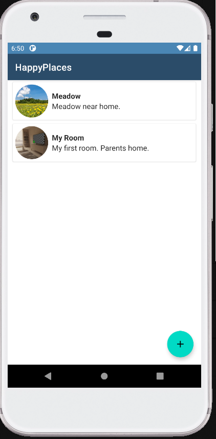
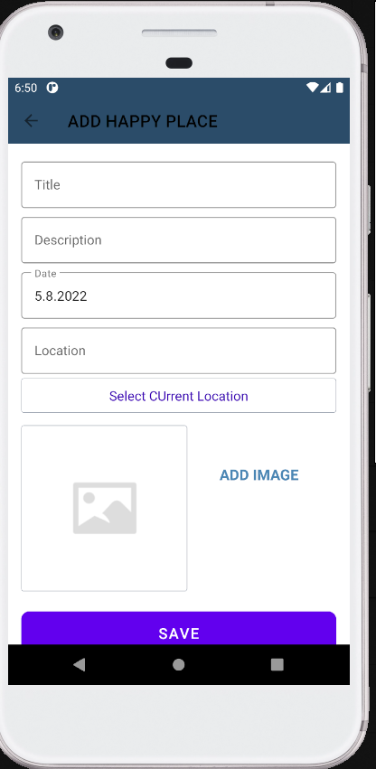
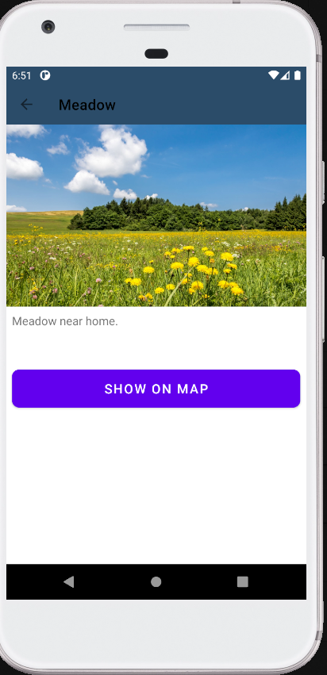
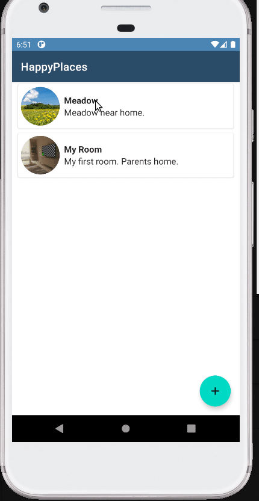

# HappyPlaces
App for storing list of locations with location, description and image.

<h3>User can:</h3>

- add new place to list,
- each place contains info: name, description, location, date and image,
- image for place can be from gallery or taken with camera,
- location can be picked with google map services,
- swipe lefr to remove saved place,
- swipe right to edit place,
- click on place to view its details.

<h3>Used technologies:</h3>

- floating action button,
- custom toolbar,
- date picker dialog,
- DEXTER library for permission handling,
- selecting photos from internal storage,
- taking photos with camera,
- sqlite,
- recycler,
- parcelable,
- integration with google location,
- finding views from layout with view binding.

<h3>App screenshots:</h3>

List of happy places          |  Add/edit place | Place details
:-------------------------:|:-------------------------:|:-------------------------:
  |  |  

<h3>App during usage:</h3>

Edition           |  Removal
:-------------------------:|:-------------------------:
  |   
